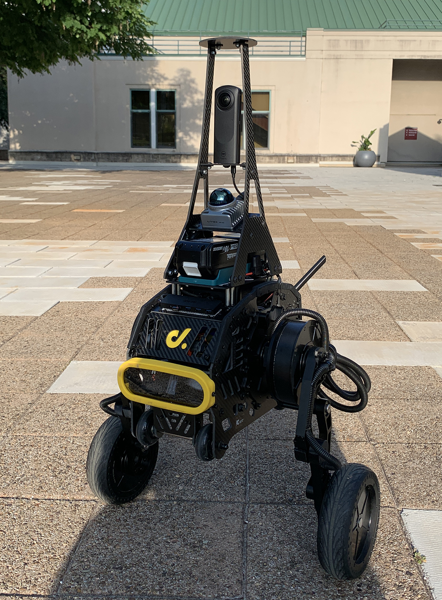
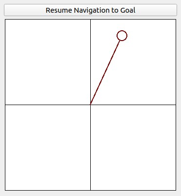
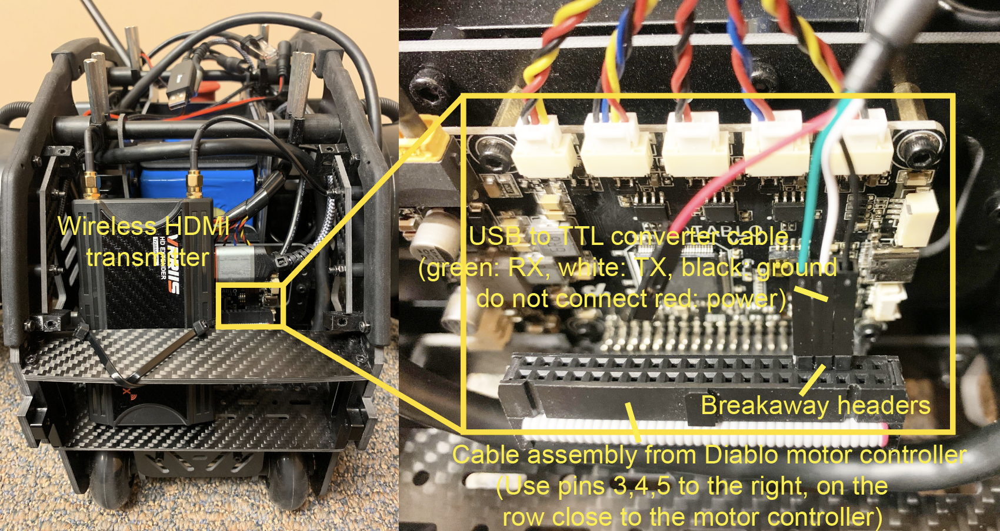
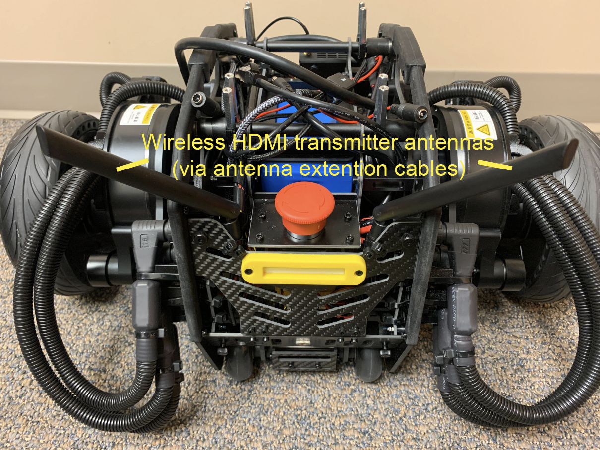
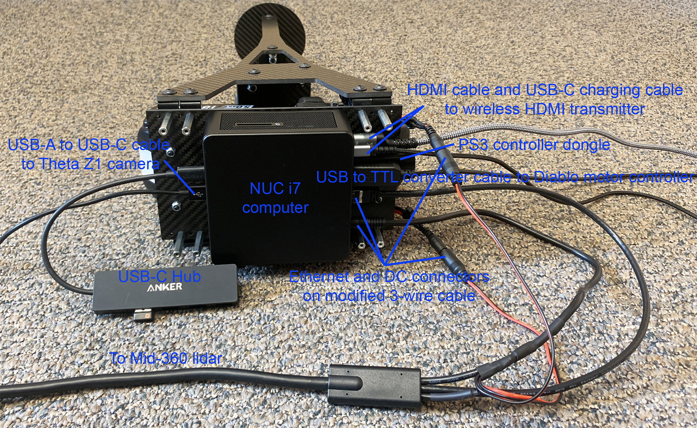
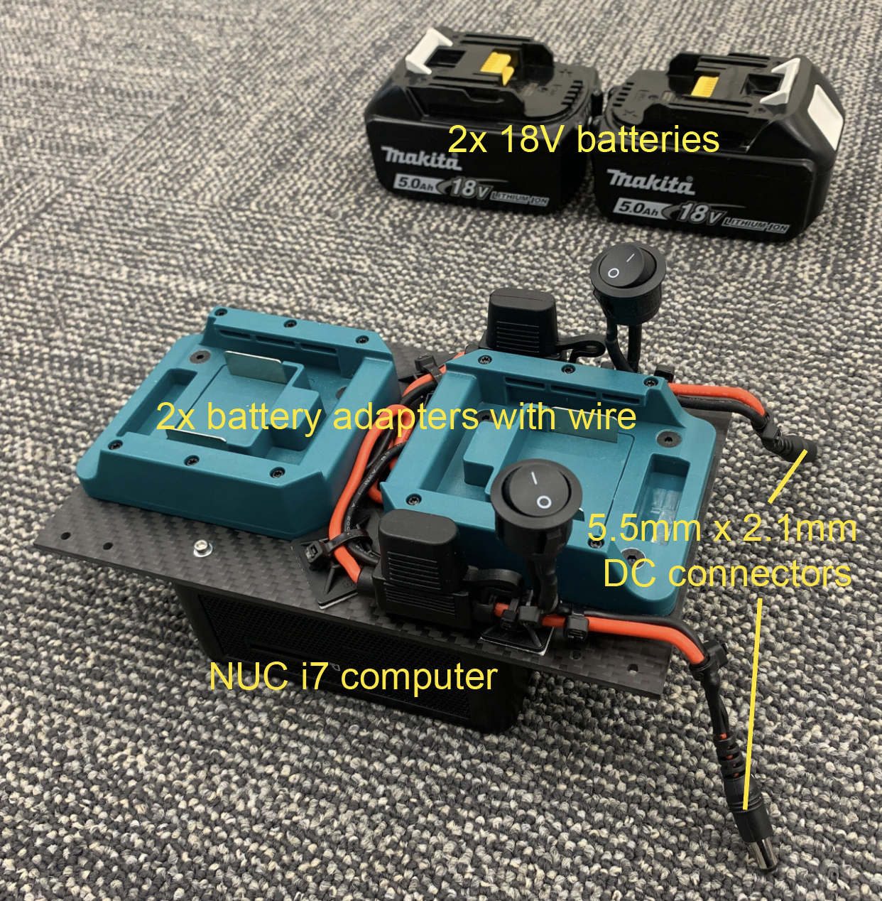
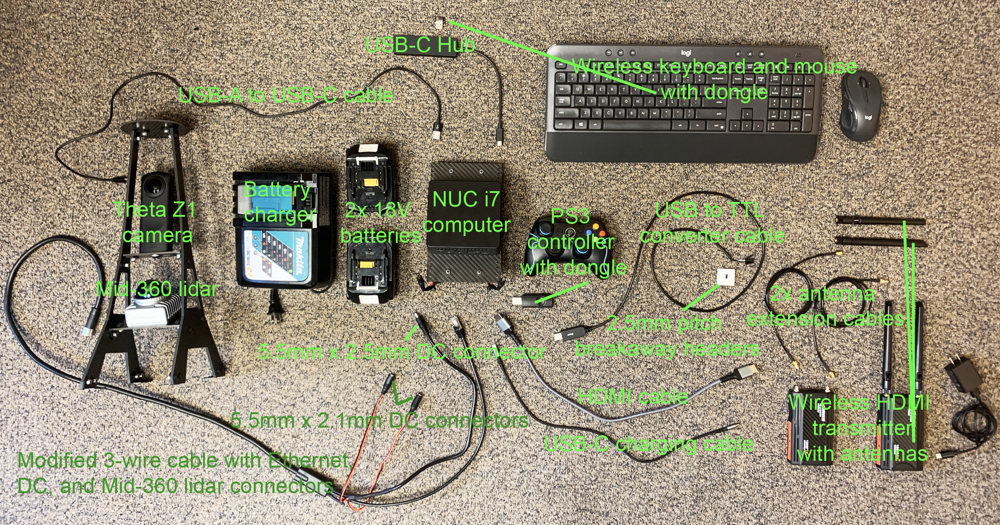
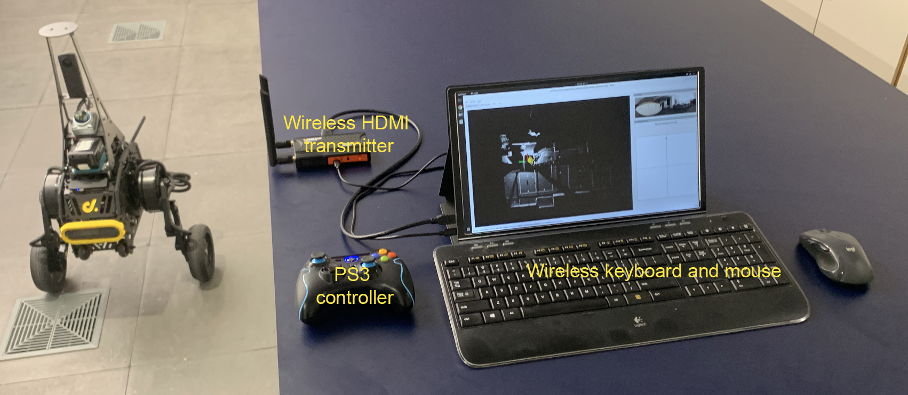
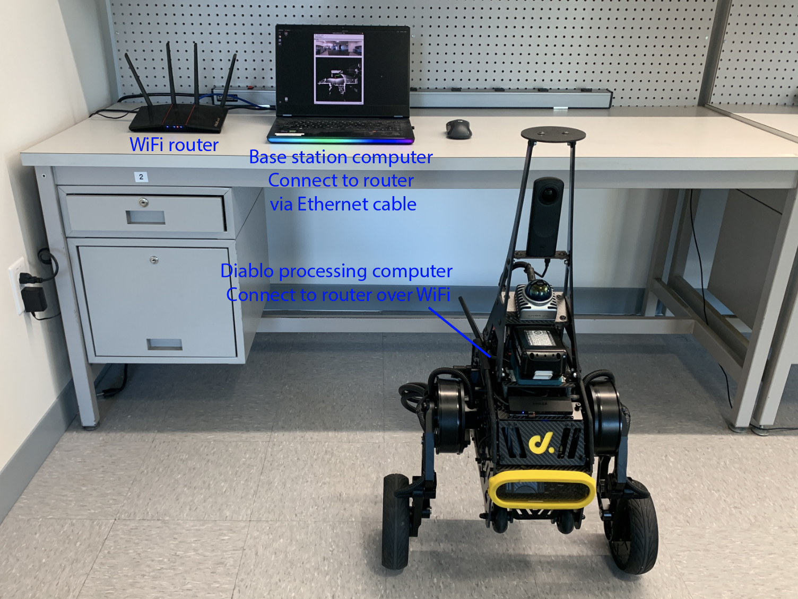

# CMU Planner Fork for D1H + ODIN

This fork is the working repository for the current **D1H + ODIN** real-robot setup. The validated real-robot chain in this repository is no longer the original Diablo-only stack from upstream. The current arrangement is:

- **Vendor low-level control** stays in `/opt/d1_ros2`
- **ODIN sensing and bridge** run from this repository
- **Route / exploration planning** run from this repository
- **Waypoint following** runs from this repository
- **Final motion output** is sent to the vendor ROS2 command topic `/d15020108/command/cmd_twist`

In other words, this repo now acts as the **upper autonomy stack** for D1H, while the vendor bringup remains the real low-level controller.

## Chinese Parameter Guide

For the current D1H + ODIN real-robot stack, a Chinese parameter guide is available here:

- [docs/D1H_ODIN_PARAMETER_GUIDE_CN.md](/home/robot/cmu_planner/docs/D1H_ODIN_PARAMETER_GUIDE_CN.md)
- [docs/TARE_EXPLORATION_GUIDE_CN.md](/home/robot/cmu_planner/docs/TARE_EXPLORATION_GUIDE_CN.md)
- [docs/STAIR_2_5D_PLAN_CN.md](/home/robot/cmu_planner/docs/STAIR_2_5D_PLAN_CN.md)
- [docs/MINIMAL_WHITEBOX_STAIR_SCENE_CN.md](/home/robot/cmu_planner/docs/MINIMAL_WHITEBOX_STAIR_SCENE_CN.md)

It summarizes the main robot / scene / sensor / obstacle / exploration parameters, what they mean, their current values, and when you would consider changing them.

## Gazebo Route-Planner Simulation

This fork now includes a Gazebo-based route-planner simulation path. The goal of this path is not to replace the existing ROS-side motion model with Gazebo physics. It keeps the original `vehicleSimulator` as the authoritative kinematic source, matching the old Unity architecture, and only replaces the Unity rendering / sensing side with Gazebo.

The interface mapping is:

- `vehicleSimulator` still subscribes to `/cmd_vel`
- `vehicleSimulator` still publishes `/state_estimation`
- `vehicleSimulator` still publishes `/unity_sim/set_model_state`
- Gazebo receives `/unity_sim/set_model_state` and synchronizes the displayed D1 model pose
- Gazebo publishes lidar data on `/lidar/points`
- `registeredScanFromOdom` converts `/lidar/points` plus `/state_estimation` into the planner-facing `/registered_scan`
- In the whitebox multi-level scene, `whitebox_stair_goal_router.py` consumes `/goal_point`; it compares the robot's current floor from `/state_estimation.z` with the requested goal floor from `/goal_point.z`. Same-floor goals pass through to FAR on `/routed_goal_point`; cross-floor goals are routed through the known stair connector and a simulation-only `/whitebox_vehicle_pose_override`.

This means the route planner, local planner, waypoint follower, `/cmd_vel`, `/state_estimation`, and `/registered_scan` contracts remain aligned with the Unity simulation path. Gazebo is currently used as a visual and point-cloud backend, not as a wheel / leg contact dynamics simulator.

### Build

For the Gazebo route-planner path, build at least:

```bash
cd /home/robot/cmu_planner
colcon build --packages-select vehicle_simulator far_planner --cmake-args -DCMAKE_BUILD_TYPE=Release
source ./source_workspace_setup.bash
```

### Launch With GUI

```bash
cd /home/robot/cmu_planner
./system_simulation_with_route_planner.sh --gazebo
```

This starts Gazebo, RViz, the original `vehicleSimulator`, FAR planner, local planner, terrain analysis, and the Gazebo point-cloud bridge. In RViz, use the `Goalpoint` tool to send a navigation goal.

For multi-level whitebox scenes, `Goalpoint` exposes a `Goal Z Mode` tool property. Use `current` for the old behavior, `floor1` for `z=0.75`, `floor2` for `z=3.75`, or `custom` plus `Custom Goal Z`. This is how the same RViz XY click distinguishes a lower-floor goal from an upper-floor goal.

### Headless Check

```bash
cd /home/robot/cmu_planner
./system_simulation_with_route_planner.sh --gazebo --no-rviz
```

This is useful for checking topic rates or launch stability without the GUIs.

### Current Test World

The current Gazebo test world defaults to a fixed realistic 2.5D whitebox terrain scene:

- `36m x 36m` flat floor
- 4 fixed ramps with different lengths and rises
- 4 fixed single steps with `0.08m`, `0.10m`, and `0.15m` heights
- 1 realistic south split stair with two flights, a middle landing, and 20 total steps
- 1 north service stair connector candidate for testing cross-floor connector selection
- each realistic stair step has `0.15m` rise, `0.28m` tread, and `1.2m` width
- 1 second-floor landing at `3.0m`
- D1 visual model loaded from `src/D1`
- lidar mounted at the ROS `sensor` frame so the generated cloud follows `/state_estimation`

The world geometry is generated by:

```bash
python3 scripts/generate_whitebox_stair_test_scene.py --profile realistic
```

Use `--profile compact` to regenerate the previous `0.6m` quick regression scene.

The generated OBJ / PLY / JSON files live under `src/base_autonomy/vehicle_simulator/mesh/whitebox_stair_test/` and are intentionally ignored by git. The launch wrapper regenerates them before starting Gazebo.

The current navigation stack is not purely 2D, but it is also not a full 3D voxel planner. It uses 3D point-cloud input, projects it into XY terrain cells, estimates local elevation, and stores relative terrain height in point intensity for downstream obstacle and cost checks. This is the 2.5D layer that the ramp / step / stair scene is meant to expose before changing any stair-navigation policy.

To first verify the generated global terrain geometry:

```bash
python3 scripts/analyze_whitebox_terrain_map.py \
  --ply src/base_autonomy/vehicle_simulator/mesh/whitebox_stair_test/map.ply
```

To inspect the live local 2.5D terrain expression numerically, run this while Gazebo is active:

```bash
python3 scripts/analyze_whitebox_terrain_map.py --topic /terrain_map
```

The script prints per-ramp, per-step, and per-stair statistics for point count, `z`, `intensity`, `terrain_class`, and direction fields. In topic mode, regions that are not inside the robot's current observed cloud are reported as `outside_current_cloud_xy`; drive or set goals near a feature before using its `/terrain_map` intensity statistics.

Current debug classes are:

- `flat`
- `ramp_like_traversable`
- `step_like`
- `stair_like`
- `obstacle_like`
- `rough_or_uncertain`

For the generated whitebox scene, classification uses the known region metadata as a validation prior plus measured height/intensity statistics. It is a debug label for verifying the 2.5D data path, not yet a production planner policy.

Whitebox ramp and stair regions also include direction metadata:

- `traversal_axis`: the low-to-high direction for ramps/stairs.
- `entry_side`: the lower side where ascent should start.
- `approach_alignment`: dot product between robot heading and `traversal_axis`.
- `approach_class`: `front_ascent_aligned`, `reverse_or_descent_aligned`, `side_view_blocking`, or `oblique_uncertain`.
- `stair_traversal_decision`: debug decision for stair traversal. Only `front_entry_candidate` should be considered traversable; `side_blocked` must be treated as a side obstacle.

The current front-entry threshold is `approach_alignment >= 0.80`, roughly within 37 degrees of the stair ascent axis.

To automate that live check, run the simulation and then run:

```bash
python3 scripts/probe_whitebox_terrain_topics.py
```

The probe script publishes RViz-equivalent goals on `/goal_point`, publishes a synthetic `/joy` autonomy-enable input, waits for `/state_estimation` to approach each fixed terrain probe, and saves `/registered_scan`, `/terrain_map`, and `/terrain_map_ext` statistics and terrain-class labels under `logs/whitebox_terrain_probe/<timestamp>/`.

To specifically test the current one-floor-to-two-floor route:

```bash
python3 scripts/probe_whitebox_terrain_topics.py \
  --probe two_floor_goal \
  --require-goal-z
```

This uses normal `/goal_point` goals, not direct `/way_point` injection. With `--require-goal-z`, the summary records `expected_odom_z` and `min_z_error`, so a second-floor target is only successful if `/state_estimation.z` reaches the requested floor height instead of merely reaching the same XY projection.

To validate the bidirectional stair connector, run:

```bash
python3 scripts/probe_whitebox_terrain_topics.py \
  --probe two_floor_round_trip \
  --require-goal-z
```

`two_floor_round_trip` is a scenario alias: it first publishes `two_floor_goal` to reach the second floor, then publishes `floor2_to_floor1_goal` with first-floor height so the router must use the reverse stair connector.

Validated round-trip probe runs include `logs/whitebox_terrain_probe/20260428_163140_round_trip/summary.json` and `logs/whitebox_terrain_probe/20260503_193442_multi_connector_round_trip/summary.json`. Both reached the upstairs and downstairs segments with upstairs `final_odom_z=3.75m` and downstairs `final_odom_z=0.75m`.

For the multi-level realistic scene, Gazebo still provides the planner-facing lidar and terrain maps. Two whitebox-only helpers use the generated scene metadata: `/whitebox_vehicle_terrain_map` feeds `vehicleSimulator` an unambiguous current floor height, and `whitebox_stair_goal_router.py` routes only cross-floor goals through the known stair connector.

The generated scene metadata now exposes stair connectivity explicitly through `connectors`. The realistic profile writes two entries: `south_split_stair_connector` for the main two-flight stair and `north_service_stair_connector` for a second candidate entrance used to validate connector selection. Each entry includes:

- `lower_floor` / `upper_floor`
- `lower_entry_goal` / `upper_entry_goal`
- `up_route` / `down_route`
- `allowed_directions`
- `controller: stair_policy_placeholder`

`whitebox_stair_goal_router.py` reads these connectors first and only falls back to object-name inference for older metadata. When multiple connectors are available, it selects by current robot position to entry plus connector exit to final goal distance. This makes the stair connection a planner-facing data structure instead of a private router hardcode.

The router is intentionally segmented:

- Same-floor: publish the requested goal directly to FAR.
- Floor 1 to floor 2: FAR drives to `stair_preentry`, `STAIR_EXEC` drives the known upward connector to `floor2_entry`, then FAR resumes on upstairs platform goals.
- Floor 2 to floor 1: FAR drives to `floor2_entry`, `STAIR_EXEC` drives the same connector in reverse to `stair_preentry`, then FAR resumes on the downstairs final goal.
- `POST_STAIR_EXEC_FALLBACK`: still exists as an explicit failure mode if FAR cannot connect a post-stair subgoal within the timeout, but it should not be used in the validated nominal two-floor probe.

This is based on odometry height, not on a hardcoded "second click" rule. For example, when `/state_estimation.z` is near the second-floor odom height and RViz publishes a `floor1` goal, the router plans a downward route through the stair connector; when the robot is already on the target floor, the goal is passed directly to FAR.

While `STAIR_EXEC` or `POST_STAIR_EXEC_FALLBACK` is active, the router also publishes `/stop=2` and zero `/cmd_vel` so the original `pathFollower` does not keep driving a stale FAR waypoint during the simulated stair-controller segment. The next FAR-controlled segment releases `/stop=0`.

### Current Scope

This Gazebo path is currently for validating that the existing navigation stack still works after replacing Unity as the sensing backend and for inspecting 2.5D terrain-map behavior. The current whitebox cross-floor path reaches the upstairs target through a known stair connector, then returns control to FAR for same-floor platform travel.

Validated probe run: `logs/whitebox_terrain_probe/20260425_141035_tight_stair_exit/summary.json` reached the second-floor goal with `final_odom_z=3.75m`, `expected_odom_z=3.75m`, and `min_z_error=0.00m`. The key routing fix is that `floor2_entry` is treated as the last stair-controller handoff point with a tight exit radius before FAR resumes on the upstairs platform.

## Current Validated Real-Robot Workflow

### 当前推荐启动方式

下面这套是目前推荐的真机探索启动流程。核心原则只有两条：

- 每次测试前，先清掉上一轮 `cmu_planner` 上层残留进程
- 不要手动去动 `/opt/d1_ros2` 的 vendor 底层控制服务

这套流程默认假设：

- vendor 低层已经正常运行
- 遥控器可以切到 `SDK mode`
- 当前仓库已经编译并 `source ./source_workspace_setup.bash`

#### 1. 先清理上一轮上层进程

```bash
cd /home/robot/cmu_planner
./scripts/cleanup_d1_nav_stack.sh
```

这条命令只清理本仓库的上层导航 / 探索 / ODIN bridge / Foxglove 相关进程，不会去停 vendor 底层控制。

#### 2. 当前推荐方式：先单独起探索

```bash
cd /home/robot/cmu_planner
./scripts/start_d1_exploration_only.sh
```

这条脚本会自动做几件事：

- 启动前再次清理旧的上层进程
- 在当前终端前台启动真机探索 launch
- 打印当前使用的边界文件、配置文件和日志路径
- 让启动期的真实报错直接打印在当前终端，方便判断是“上层真的退了”，还是“上层还活着但车暂时没走”

注意：

- 这条脚本现在是 **前台运行**
- 启动后请保持这个终端不要关
- 停止时直接在这个终端里按 `Ctrl+C`

补充说明：

- 之前我们已经定位过一个脚本级问题：
  - `start_d1_exploration_only.sh` 早期版本会因为 `set -u` 和 ROS `setup.bash` 的组合，在启动时直接报
    `AMENT_TRACE_SETUP_FILES: unbound variable`
  - 这个问题现在已经修掉
- 所以如果你后面再看到“探索刚启动就立刻退出”，不要先怀疑参数，先确认自己用的是仓库里最新脚本

默认使用：

- 边界文件：
  - `src/exploration_planner/tare_planner/data/boundary_from_odom.ply`
- 探索配置：
  - `src/exploration_planner/tare_planner/config/indoor_d1h_20x5_reference.yaml`

之所以推荐分两步，是因为这台机器在 **探索 + ODIN + Foxglove 同时抢启动资源** 时，更容易出现：

- 上层刚起来又退掉
- Foxglove 没拉起来
- 话题没完全传出去

#### 3. 等探索先稳定，再单独起 Foxglove

```bash
cd /home/robot/cmu_planner
./scripts/start_foxglove_filtered.sh
```

如果你想后台起，也可以单独开一个终端跑这条。

#### 4. 如果要显式指定边界和配置文件

```bash
cd /home/robot/cmu_planner
./scripts/start_d1_exploration_only.sh \
  --boundary-file src/exploration_planner/tare_planner/data/boundary_from_odom.ply \
  --config-file src/exploration_planner/tare_planner/config/indoor_d1h_20x5_reference.yaml
```

#### 5. 如果要临时覆盖局部规划的障碍阈值

例如：

```bash
cd /home/robot/cmu_planner
./scripts/start_d1_exploration_only.sh \
  --obstacle-height-thre 0.08 \
  --ground-height-thre 0.05
```

这样做只影响这一轮启动，不会改仓库默认值。

#### 5.1 如果你还是想用一条命令一起起

仓库里仍然保留了组合脚本：

```bash
cd /home/robot/cmu_planner
./scripts/start_d1_exploration_with_foxglove.sh \
  --foxglove-delay-seconds 15
```

但目前 **不推荐把它当主流程**。

如果你只想先测探索，不想同时起远端可视化：

```bash
cd /home/robot/cmu_planner
./scripts/start_d1_exploration_with_foxglove.sh --no-foxglove
```

#### 6. Foxglove 连接地址

脚本启动成功后，Foxglove 默认监听：

```text
ws://10.1.1.36:8765
```

如果机器人 IP 变了，脚本会按当前机器 IP 打印新的地址。

#### 7. 启动后怎么判断是不是真的正常

不要只看 launch 终端“像是起来了”。推荐直接检查这几项：

```bash
source /opt/ros/humble/setup.bash
source /opt/d1_ros2/local_setup.bash
cd /home/robot/cmu_planner
source ./source_workspace_setup.bash
export ROS_DOMAIN_ID=42
export ROS_LOCALHOST_ONLY=0
export RMW_IMPLEMENTATION=rmw_fastrtps_cpp

ros2 topic list | grep -E "registered_scan|state_estimation|way_point|path"
ros2 topic echo /way_point --once
ros2 topic echo /state_estimation --once
```

一轮真正正常的启动，至少应该满足：

- `/registered_scan` 在发
- `/state_estimation` 在发
- `/way_point` 会出现
- `/path` 会随着规划更新
- 前台终端里能看到：
  - `Exploration Started`
  - `localPlanner received waypoint ... autonomy=true`
  - `pathFollower received waypoint ... autonomy=true`

如果机器人已经切到 `SDK mode`，还可以进一步看：

```bash
ros2 topic echo /d15020108/command/cmd_twist --once
```

如果这条也有输出，说明上层已经在真正给底层发速度命令。

这次前台诊断时，稳定运行的一轮会继续出现类似日志：

```text
Exploration Started
localPlanner received waypoint: frame=map ...
pathFollower received waypoint: frame=map ...
pathFollower status: autonomy=true ... cmd_vx=0.315
```

如果前台启动后很快只剩 D1 底层节点，而 `/registered_scan`、`/state_estimation`、`/way_point`、`/path` 都一起消失，那就是上层真的退了；如果这些话题还在，只是车没动，那就不是“上层直接死掉”。

#### 8. 当前探索真机上必须注意的一点

当前自定义探索配置已经统一为：

- TARE 使用 `/state_estimation`
- 不再使用 `/state_estimation_at_scan` 作为探索主位姿

这是因为真机上 `/state_estimation_at_scan` 和当前实时位姿可能明显错开，容易导致：

- `local_path` 和真实 odom 不对齐
- `localPlanner failed to find path`
- 机器人卡住不动

如果以后换配置文件，记得检查：

- `sub_state_estimation_topic_ : /state_estimation`

#### 9. 常见故障的最短排查顺序

- 机器人不动：
  - 先确认是否切到 `SDK mode`
  - 再看 `/way_point`
  - 再看 `/path`
  - 最后看 `/d15020108/command/cmd_twist`
- Foxglove 连不上：
  - 先确认 `start_foxglove_filtered.sh` 已经启动
  - 再看 `8765` 端口是否监听
  - 再看是否连的是当前脚本打印出来的 IP
- 轨迹和 odom 明显错位：
  - 先检查当前探索 yaml 是否仍在用 `/state_estimation`

#### 10. 停止当前这一轮

```bash
cd /home/robot/cmu_planner
./scripts/cleanup_d1_nav_stack.sh
```

如果只是想停上层，这一条就够了。

## 固定地图与重定位流程

如果你想要的是：

- 地图保持固定不动
- 机器人可以从场地内不同位置启动
- 启动后仍然落在同一张全局地图里

那就不要继续使用“每次启动重新定义本地 map”的方式，而是走下面这条链：

1. 先用 ODIN 建一张固定地图
2. 保存地图文件
3. 停掉建图模式
4. 用同一张地图启动 relocalization
5. 在 relocalization 模式下再起探索

### 1. 启动 ODIN 建图模式

```bash
cd /home/robot/cmu_planner
./scripts/start_odin_mapping_only.sh
```

启动后：

- 用遥控器带机器人把场地主要区域扫一遍
- 尽量形成一些回环
- 重点把后续要探索的区域都扫进去

这个脚本会临时把 ODIN 切到：

- `custom_map_mode = 1`

并在退出时自动恢复默认配置。

### 2. 保存地图

扫完之后，另开一个终端执行：

```bash
cd /home/robot/cmu_planner
./scripts/save_odin_map.sh
```

当前人工建图默认保存到：

- [src/odin_ros_driver/map/manual_maps](/home/robot/cmu_planner/src/odin_ros_driver/map/manual_maps)

例如我们当前已经保存过一张：

- [map_20260423_085941.bin](/home/robot/cmu_planner/src/odin_ros_driver/map/manual_maps/map_20260423_085941.bin)

### 3. 停止建图模式

```bash
cd /home/robot/cmu_planner
./scripts/stop_odin_mapping_only.sh
```

### 4. 单独启动重定位模式

```bash
cd /home/robot/cmu_planner
./scripts/start_odin_relocalization_only.sh
```

如果要显式指定某张地图：

```bash
cd /home/robot/cmu_planner
./scripts/start_odin_relocalization_only.sh \
  --map-file /home/robot/cmu_planner/src/odin_ros_driver/map/manual_maps/map_20260423_085941.bin
```

这个脚本会把 ODIN 切到：

- `custom_map_mode = 2`

并把 `relocalization_map_abs_path` 指向指定地图文件。

如果需要停止：

```bash
cd /home/robot/cmu_planner
./scripts/stop_odin_relocalization_only.sh
```

### 5. 在重定位模式下启动探索

如果你想直接验证“固定地图 + 探索”，用这条：

```bash
cd /home/robot/cmu_planner
./scripts/start_d1_exploration_relocalization.sh
```

如果要显式指定地图：

```bash
cd /home/robot/cmu_planner
./scripts/start_d1_exploration_relocalization.sh \
  --map-file /home/robot/cmu_planner/src/odin_ros_driver/map/manual_maps/map_20260423_085941.bin
```

这一条脚本做了几件关键事情：

- 先清掉上一轮上层进程
- 用 relocalization 模式启动 ODIN
- 启动探索主链
- **关闭 launch 里原来写死的静态 `map -> odom`**

最后这一点很重要。因为如果还保留那个静态 `map -> odom = identity`，重定位结果会被顶掉，固定地图就没有意义了。

### 6. 目前我们已经验证到什么程度

当前这条固定地图链已经验证到：

- relocalization 模式能够正常启动
- 已保存地图能够成功加载
- 真机探索链在 relocalization 模式下能够正常运行
- `/state_estimation` 已经重新收敛成单一来源，避免了之前 `map/odom` 混发的问题

这意味着：

- 这套流程已经可以作为“固定地图模式”的基础使用

但如果你要做更强的验证，仍然建议：

- 多换几个起点重启几次
- 看机器人是否总能落回同一张固定地图

### 7. 这条链和普通探索启动的区别

普通探索启动：

- 每次启动时，`map` 基本跟着机器人初始位置重新建立

重定位探索启动：

- 先把机器人对到已保存地图
- 再在这张固定地图里探索

所以如果你的目标是：

- 地图不动
- 机器人换地方启动

那后面请优先使用：

```bash
./scripts/start_d1_exploration_relocalization.sh
```

## Weekly Update

### 2026-04-19

This week focused on stabilizing the **D1H + ODIN real-robot integration path**, especially the ODIN sensing bridge and the upper navigation stack behavior on hardware.

- Verified the current real-robot command path:
  - vendor low-level control remains in `/opt/d1_ros2`
  - this repository provides ODIN sensing, autonomy bridge, FAR planner, local planner, and path follower
  - final motion output is sent to `/d15020108/command/cmd_twist`
- Completed repeated real-robot bringup / teardown cleanup for the upper stack and standardized the workflow around:
  - `system_real_robot_with_route_planner_d1.sh`
  - `system_real_robot_with_exploration_planner_d1.sh`
  - `scripts/stop_d1_nav_stack.sh`
- Verified remote RViz workflow on a second Ubuntu machine using:
  - `D1_RUN_RVIZ=0`
  - `D1_ROS_LOCALHOST_ONLY=0`
  - `ROS_DOMAIN_ID=42`

### Main debugging work completed

- Diagnosed a major ODIN bridge performance bottleneck.
  - Raw ODIN topics were healthy, but bridge outputs were heavily degraded.
  - In the initial minimal test chain:
    - `/odin1/cloud_slam` was about `10.28 Hz`
    - `/registered_scan` dropped to about `1.05 Hz`
    - `/odin1/odometry` was about `10.27 Hz`
    - `/state_estimation` dropped to about `2.73 Hz`
    - `/odin1/imu` was about `396.43 Hz`
    - `/imu/data` dropped to about `61.43 Hz`
- Root cause analysis showed the slowdown was **not from ODIN itself**, but from the bridge layer in this repository.
  - The old bridge path handled cloud / odom / imu together.
  - The cloud callback was especially expensive because ODIN publishes `x y z rgb`, while downstream expected `intensity`.
  - The old bridge therefore rebuilt the point cloud frame-by-frame and also blocked odom / imu handling.
- Implemented bridge-side optimizations in:
  - [src/utilities/odin_autonomy_bridge/src/odin_autonomy_bridge_node.cpp](src/utilities/odin_autonomy_bridge/src/odin_autonomy_bridge_node.cpp)
  - [src/utilities/odin_autonomy_bridge/launch/odin_autonomy_bridge.launch.py](src/utilities/odin_autonomy_bridge/launch/odin_autonomy_bridge.launch.py)

### Bridge improvements now kept in the repo

- Added a fast cloud conversion path:
  - when ODIN cloud format is `x y z rgb` or `x y z rgba`, the bridge aliases the color field to `intensity` instead of rebuilding the full cloud point-by-point
- Removed unnecessary deep copies in the bridge callbacks where possible
- Added bridge-instance role switches:
  - `enable_odom_bridge`
  - `enable_cloud_bridge`
  - `enable_imu_bridge`
- Split the previous single bridge process into **three independent bridge instances**:
  - odom bridge
  - cloud bridge
  - imu bridge

### Measured effect after splitting the bridge

With the split bridge architecture enabled, the minimal ODIN test chain measured:

- `/odin1/cloud_slam`: `10.26 Hz`
- `/registered_scan`: `10.32 Hz`
- `/odin1/odometry`: `10.26 Hz`
- `/state_estimation`: `10.26 Hz`
- `/odin1/imu`: `396.46 Hz`
- `/imu/data`: `399.04 Hz`

This means the bridge output rate was brought back to approximately the same level as the ODIN source rate, and the previous bridge bottleneck was effectively removed in the isolated validation setup.

### Navigation-side notes

- A temporary experiment was performed to let real-robot `localPlanner` consume `/registered_scan` directly instead of `/terrain_map`.
- That experiment improved obstacle-source freshness but made the current planner configuration too conservative on hardware, often degenerating to a zero-length local path.
- For stability, the real-robot route / exploration / MTARE launches were restored to the original `terrain_map`-based local-planning path.
- The parameterized `useTerrainAnalysis` support and runtime logging were kept in:
  - [src/base_autonomy/local_planner/launch/local_planner.launch](src/base_autonomy/local_planner/launch/local_planner.launch)
  - [src/base_autonomy/local_planner/src/localPlanner.cpp](src/base_autonomy/local_planner/src/localPlanner.cpp)

### Current practical status

- The repository now contains a much faster ODIN autonomy bridge implementation.
- The real-robot navigation launches are still configured conservatively to use `terrain_map` for local planning.
- The split ODIN bridge should be the preferred base for the next round of full-stack real-robot navigation tests.

### 2026-04-21

This round focused on making the **real-robot exploration workflow repeatable**, explaining the TARE exploration logic, and separating real algorithm issues from startup / visualization noise.

### Exploration workflow and tooling

- Standardized the real-robot exploration startup sequence so we always:
  - clean the previous upper stack
  - start exploration first
  - start Foxglove separately after exploration is stable
- Added and validated helper scripts:
  - [scripts/start_d1_exploration_only.sh](/home/robot/cmu_planner/scripts/start_d1_exploration_only.sh)
  - [scripts/start_d1_exploration_with_foxglove.sh](/home/robot/cmu_planner/scripts/start_d1_exploration_with_foxglove.sh)
  - [scripts/start_foxglove_filtered.sh](/home/robot/cmu_planner/scripts/start_foxglove_filtered.sh)
  - [scripts/cleanup_d1_nav_stack.sh](/home/robot/cmu_planner/scripts/cleanup_d1_nav_stack.sh)
- Fixed the exploration foreground script so it no longer dies on ROS setup with:
  - `AMENT_TRACE_SETUP_FILES: unbound variable`
- Confirmed that the unstable behavior we saw before was often from:
  - mixed old processes
  - background startup hiding real launch errors
  - exploration and Foxglove competing for resources during startup

### Foxglove and remote visualization

- Brought up Foxglove reliably on the real robot and moved to a “start it separately” workflow.
- Added Chinese documentation for the current Foxglove usage and topic interpretation:
  - [docs/FOXGLOVE_LAYOUT.md](/home/robot/cmu_planner/docs/FOXGLOVE_LAYOUT.md)
- Verified that Foxglove can advertise and stream:
  - `/terrain_map`
  - `/terrain_map_ext`
  - `/path`
  - `/way_point`
  - exploration clouds and viewpoint clouds
- Removed `/registered_scan` from the filtered Foxglove bridge path to reduce remote bandwidth and topic overload during exploration monitoring.
- Identified that several `tare_visualizer/*` cloud topics are poor real-time debugging sources, while the actually useful exploration-debug clouds are:
  - `/viewpoint_vis_cloud`
  - `/selected_viewpoint_vis_cloud`
  - `/lookahead_point_cloud`

### Exploration-side debugging conclusions

- Confirmed that TARE can return home **before the human operator feels the full navigation boundary has been explored**.
- Traced this to TARE’s own completion logic:
  - completion is driven by frontier / uncovered / viewpoint selection state
  - not by physically traversing every part of the boundary
- Verified with runtime checks that:
  - `/exploration_finish` becomes `true`
  - `/way_point` switches back to the origin region
  - the stack is still alive when this happens, so this is a planner decision, not a crash
- Confirmed that the previous `/state_estimation_at_scan` vs `/state_estimation` mismatch was a real issue on hardware.
  - TARE was updated to use `/state_estimation` in the custom exploration configs
  - this removed a major odom / local-path inconsistency during exploration

### Robot / environment parameter work

- Added Chinese parameter documentation for robot size, sensing, terrain interpretation, and exploration tuning:
  - [docs/D1H_ODIN_PARAMETER_GUIDE_CN.md](/home/robot/cmu_planner/docs/D1H_ODIN_PARAMETER_GUIDE_CN.md)
  - [docs/TARE_EXPLORATION_GUIDE_CN.md](/home/robot/cmu_planner/docs/TARE_EXPLORATION_GUIDE_CN.md)
- Incorporated current D1H physical-envelope assumptions into the tuning notes:
  - standing size about `375/750 x 493 x 643 mm`
  - crouched size about `470/845 x 580 x 250 mm`
- Added a boundary-recording workflow from ODIN odometry:
  - [scripts/record_boundary_from_odom.py](/home/robot/cmu_planner/scripts/record_boundary_from_odom.py)
  - [scripts/record_boundary_from_odom.sh](/home/robot/cmu_planner/scripts/record_boundary_from_odom.sh)
- Generated and used:
  - [boundary_from_odom.ply](/home/robot/cmu_planner/src/exploration_planner/tare_planner/data/boundary_from_odom.ply)

### Parameter experiments done on hardware

- Tested lower obstacle thresholds for low-profile obstacles:
  - `obstacleHeightThre` was experimentally reduced from `0.15` to `0.10`, then `0.08`
- Tested exploration-side sensor range reduction:
  - `kSensorRange` reduced to `2.5` for the current site
- Tested larger local-planner body envelope through launch-time overrides:
  - temporary comparisons with larger `vehicleLength` / `vehicleWidth`
- Outcome so far:
  - lower obstacle thresholds can help treat lower obstacles more conservatively
  - but the dominant remaining exploration issue is still **early return-home / early completion**
  - not a simple startup failure or Foxglove failure

### Current interpretation of the remaining exploration issue

- The current site-specific issue is likely not “the system crashes”.
- It is more likely:
  - small frontier clusters are being discarded too early
  - cells are being marked `covered` too aggressively
  - local viewpoint selection becomes empty too early
- To support that next round of tests, a more conservative site-specific exploration config was added:
  - [indoor_d1h_20x5_deeper_coverage.yaml](/home/robot/cmu_planner/src/exploration_planner/tare_planner/config/indoor_d1h_20x5_deeper_coverage.yaml)

### Current TODO

- Low obstacle handling on real hardware still needs more validation.
  - In the current stack, some low-profile or hollow obstacles can be sensed by part of the pipeline but still fail to become a stable hard constraint in the final executed path.
  - We still need a clean comparison of:
    - what enters the exploration-side local candidate path
    - what enters the final `/path` and `/way_point`
    - whether low obstacles are consistently represented in `terrain_map`, contour / polygon logic, and local execution
- Foxglove exploration visualization still needs cleanup and better interpretation support.
  - The bridge is confirmed to advertise and transmit the exploration topics, but several of the current exploration-debug topics are sparse, intermittent, or publish delete markers when no active subspace exists.
  - We still need a clearer Foxglove layout / workflow for:
    - explored vs unexplored area interpretation
    - viewpoint / selected viewpoint visualization
    - uncovered cloud / frontier visualization
    - understanding why the planner chooses a given local path
- 2.5D slope / stair planning now has a Gazebo simulation baseline.
  - Completed on branch `codex/gazebo-two-floor-whitebox`:
    - Gazebo whitebox terrain backend using the existing `/cmd_vel`, `/state_estimation`, `/registered_scan`, FAR, local planner, and `vehicleSimulator` contracts.
    - realistic 2.5D scene with flat ground, ramps, single steps, split stair, north service stair, mid landing, and second-floor landing.
    - RViz goal height modes for distinguishing first-floor and second-floor goals at the same XY projection.
    - whitebox stair router based on current odom floor and target goal floor.
    - bidirectional stair connector validation through `two_floor_round_trip`.
    - explicit scene metadata `connectors` for the stair topology, including multiple candidate stair connectors.
  - Remaining simulation-first work:
    - publish cross-floor route state and selected connector for RViz/Foxglove inspection.
    - promote the current router split into a planner-facing `floor_path -> connector -> floor_path` representation.
    - remove or reduce the temporary post-stair fallback once FAR can natively connect post-stair goals.
    - keep `/terrain_class` as debug/shadow input until the task-level cross-floor route is stable.
    - extend the plan from point-goal routing to complete multi-floor exploration: floor-aware frontier / coverage state, stair connector task graph, cross-floor exploration decisions, and return-home across floors.
  - Later work:
    - online stair detection from `/terrain_class` / `/terrain_map_ext`, replacing the current metadata-only connector prior.
    - shadow-mode real robot logging on ramps / stair approaches.
    - controlled real stair tests only after the simulation classification and local-planning behavior are stable.
  - Current plan and status:
    - [docs/STAIR_2_5D_PLAN_CN.md](/home/robot/cmu_planner/docs/STAIR_2_5D_PLAN_CN.md)
  - Weekly summary:
    - [docs/WEEKLY_SUMMARY_2026_04_28_CN.md](/home/robot/cmu_planner/docs/WEEKLY_SUMMARY_2026_04_28_CN.md)

### What is in charge

- `/opt/d1_ros2`
  - vendor D1H control stack
  - `d1_bringup.service`
  - controller manager / robot state publisher / vendor teleop
- `/home/robot/cmu_planner`
  - ODIN driver and autonomy bridge
  - FAR route planner / exploration planner
  - local planner / path follower
  - D1 compatibility bridge for legacy topics

### Current real-robot data and command flow

```text
ODIN -> odin_ros_driver -> odin_autonomy_bridge -> /state_estimation + /registered_scan
                                  |
                                  v
                           far_planner -> /way_point
                                  |
                                  v
                    localPlanner + pathFollower -> /d15020108/command/cmd_twist
                                  |
                                  v
                      vendor D1H controller in /opt/d1_ros2
```

### Important behavior changes already integrated in this fork

- Real-robot launch starts in a **safe idle state**
- The robot does **not** immediately enter autonomy on startup
- Autonomy is enabled only after a real `/goal_point` is received and propagated to `/way_point`
- ODIN point cloud bridging now provides a default `intensity` field for downstream consumers
- The D1 route / exploration / MTARE helper scripts now clean up previous upper-stack processes before launch and on exit
- Remote RViz is supported by setting `D1_RUN_RVIZ=0` and `D1_ROS_LOCALHOST_ONLY=0`

### Real-robot startup

Robot-side:

```bash
cd /home/robot/cmu_planner
source ./source_workspace_setup.bash

export D1_RUN_RVIZ=0
export D1_ROS_DOMAIN_ID=42
export D1_ROS_LOCALHOST_ONLY=1   # set to 0 only if you want remote RViz

./system_real_robot_with_route_planner_d1.sh
```

Send a navigation goal from another terminal on the robot:

```bash
source /opt/ros/humble/setup.bash
source /opt/d1_ros2/local_setup.bash
export ROS_DOMAIN_ID=42
export ROS_LOCALHOST_ONLY=1
export RMW_IMPLEMENTATION=rmw_fastrtps_cpp
source /opt/d1_ros2/namespace.sh

cd /home/robot/cmu_planner
source ./source_workspace_setup.bash

ros2 topic pub --once /goal_point geometry_msgs/msg/PointStamped \
  "{header: {frame_id: map}, point: {x: 3.0, y: 0.0, z: 0.0}}"
```

### Remote RViz

If you want RViz on another Ubuntu machine instead of on the robot:

Robot-side:

```bash
cd /home/robot/cmu_planner
source ./source_workspace_setup.bash

export D1_RUN_RVIZ=0
export D1_ROS_DOMAIN_ID=42
export D1_ROS_LOCALHOST_ONLY=0

./system_real_robot_with_route_planner_d1.sh
```

Remote Ubuntu:

```bash
source /opt/ros/humble/setup.bash
export ROS_DOMAIN_ID=42
export ROS_LOCALHOST_ONLY=0
export RMW_IMPLEMENTATION=rmw_fastrtps_cpp

ros2 topic list | grep -E "state_estimation|registered_scan|path|way_point"
rviz2 -d /path/to/cmu_planner/src/route_planner/far_planner/rviz/default.rviz
```

### Remote Foxglove

For remote visualization, Foxglove Desktop is often a better fit than RViz in this setup, especially when you only want to inspect the robot from another machine.

Recommended architecture:

- run the navigation stack on the robot
- run `foxglove_bridge` on the robot
- connect from another computer using **Foxglove Desktop**

Install the bridge on the robot:

```bash
sudo apt-get update
sudo apt-get install -y ros-humble-foxglove-bridge
```

Start the bridge on the robot:

```bash
source /opt/ros/humble/setup.bash
source /opt/d1_ros2/local_setup.bash
export ROS_DOMAIN_ID=42
export ROS_LOCALHOST_ONLY=0
export RMW_IMPLEMENTATION=rmw_fastrtps_cpp
ros2 launch foxglove_bridge foxglove_bridge_launch.xml
```

Then connect from another machine using:

```text
ws://10.1.1.36:8765
```

Important note:

- prefer **Foxglove Desktop**, not the browser version
- the browser version is more likely to fail on `ws://` connections because of web security / mixed-content restrictions

On macOS, Foxglove Desktop can be opened directly with:

```bash
open "foxglove://open?ds=foxglove-websocket&ds.url=ws://10.1.1.36:8765/"
```

Recommended first Foxglove panels:

- `3D`
  - `TF`
  - `/registered_scan`
  - `/path`
  - `/way_point`
  - `/viz_graph_topic`
- `Raw Messages`
  - `/state_estimation`
  - `/goal_point`
  - `/far_reach_goal_status`
  - `/d15020108/rl_controller/fsm`
- `Plot`
  - `/state_estimation.pose.pose.position.x`
  - `/state_estimation.pose.pose.position.y`
  - `/state_estimation.twist.twist.linear.x`
  - `/state_estimation.twist.twist.angular.z`

When using Foxglove remotely over Wi-Fi, start with lighter topics first. Dense point clouds may still flicker on the remote side if the network drops packets, even when the robot-side topic rate is healthy.

### More detailed notes

For the current D1H + ODIN setup notes, command conventions, and remote RViz details, see:

- [docs/D1H_ODIN_NAV_FLOW.md](docs/D1H_ODIN_NAV_FLOW.md)
- [docs/FOXGLOVE_LAYOUT.md](docs/FOXGLOVE_LAYOUT.md)

---

The repository contains the full autonomy stack for a system setup based on the [Direct Drive Tech's Diablo platform](https://shop.directdrive.com/products/diablo-world-s-first-direct-drive-self-balancing-wheeled-leg-robot). Sensors installed on the platform include a [Livox Mid-360 lidar](https://www.livoxtech.com/mid-360) and a [Ricoh Theta Z1 camera](https://us.ricoh-imaging.com/product/theta-z1), where the lidar is used by the autonomy stack. The autonomy stack contains a SLAM module, a route planner, an exploration planner, and a based autonomy system, where the base autonomy system further includes fundamental navigation modules for terrain traversability analysts, collision avoidance, and waypoint following. The system overall is capable of taking a goal point and navigating Diablo autonomously to the goal point as well as exploring an environment and building a map along the way. Alternatively, the system allows users to use a joystick controller to guide the navigation while the system itself is in charge of collision avoidance. We provide a simulation setup together with the real robot setup for users to take advantage of the system in various use cases. A tutorial about setting up the software and hardware is also provided to make it easier for users to replicate the system.

<p align="center">
  
</p>

## Simulation Setup

### Base Autonomy

The system is integrated with [Unity](https://unity.com) environment models for simulation. The repository has been tested in Ubuntu 22.04 with [ROS2 Humble](https://docs.ros.org/en/humble/Installation.html). After installing ROS2 Humble, add 'source /opt/ros/humble/setup.bash' to the '~/.bashrc' file and `source ~/.bashrc` in the terminal to engage the installation.
```
echo "source /opt/ros/humble/setup.bash" >> ~/.bashrc
source ~/.bashrc
```
Install dependencies with the command lines below.
```
sudo apt update
sudo apt install libusb-dev ros-humble-desktop-full ros-humble-tf-transformations ros-humble-joy python3-colcon-common-extensions python-is-python3 python3-pip git
pip install transforms3d pyyaml
```
Clone the open-source repository.
```
git clone https://github.com/jizhang-cmu/autonomy_stack_diablo_setup.git

```
In a terminal, go to the folder, checkout the 'humble' branch, and compile. Note that this skips the SLAM module, Mid-360 lidar driver, and Theta Z1 camera driver. The three packages are not needed for simulation.
```
cd autonomy_stack_diablo_setup
git checkout humble
colcon build --symlink-install --cmake-args -DCMAKE_BUILD_TYPE=Release --packages-skip arise_slam_mid360 arise_slam_mid360_msgs livox_ros_driver2 receive_theta
```
Download a [Unity environment model for Diablo setup](https://drive.google.com/drive/folders/1wixBcO8gEiqXzO1qLG_Ck-XmOFqxYz6s?usp=sharing) and unzip the files to the 'src/base_autonomy/vehicle_simulator/mesh/unity' folder. The environment model files should look like below. For computers without a powerful GPU, please try the 'without_360_camera' version for a higher rendering rate.

mesh/<br>
&nbsp;&nbsp;&nbsp;&nbsp;unity/<br>
&nbsp;&nbsp;&nbsp;&nbsp;&nbsp;&nbsp;&nbsp;&nbsp;environment/<br>
&nbsp;&nbsp;&nbsp;&nbsp;&nbsp;&nbsp;&nbsp;&nbsp;&nbsp;&nbsp;&nbsp;&nbsp;Model_Data/ (multiple files in the folder)<br>
&nbsp;&nbsp;&nbsp;&nbsp;&nbsp;&nbsp;&nbsp;&nbsp;&nbsp;&nbsp;&nbsp;&nbsp;Model.x86_64<br>
&nbsp;&nbsp;&nbsp;&nbsp;&nbsp;&nbsp;&nbsp;&nbsp;&nbsp;&nbsp;&nbsp;&nbsp;UnityPlayer.so<br>
&nbsp;&nbsp;&nbsp;&nbsp;&nbsp;&nbsp;&nbsp;&nbsp;&nbsp;&nbsp;&nbsp;&nbsp;AssetList.csv (generated at runtime)<br>
&nbsp;&nbsp;&nbsp;&nbsp;&nbsp;&nbsp;&nbsp;&nbsp;&nbsp;&nbsp;&nbsp;&nbsp;Dimensions.csv<br>
&nbsp;&nbsp;&nbsp;&nbsp;&nbsp;&nbsp;&nbsp;&nbsp;&nbsp;&nbsp;&nbsp;&nbsp;Categories.csv<br>
&nbsp;&nbsp;&nbsp;&nbsp;&nbsp;&nbsp;&nbsp;&nbsp;map.ply<br>
&nbsp;&nbsp;&nbsp;&nbsp;&nbsp;&nbsp;&nbsp;&nbsp;object_list.txt<br>
&nbsp;&nbsp;&nbsp;&nbsp;&nbsp;&nbsp;&nbsp;&nbsp;traversable_area.ply<br>
&nbsp;&nbsp;&nbsp;&nbsp;&nbsp;&nbsp;&nbsp;&nbsp;map.jpg<br>
&nbsp;&nbsp;&nbsp;&nbsp;&nbsp;&nbsp;&nbsp;&nbsp;render.jpg<br>

In a terminal, go to the repository folder and launch the system.
```
./system_simulation.sh
```
After seeing data showing up in RVIZ, users can use the 'Waypoint' button to set waypoints and navigate the vehicle around. Note that the waypoints are meant to be relatively close to the vehicle. Setting the waypoint too far can cause the vehicle to get stuck at a dead end. Users can also operate in *smart joystick mode* where the vehicle tries to follow joystick commands and also avoid collisions. To do this, users can use the control panel in RVIZ or a PS3/4 or Xbox controller with a USB or Bluetooth interface. When using the controller, users can also operate in *manual mode* without any collision avoidance. Detailed information about the operations in the three modes is below.

<p align="center">
  
</p>

- *Smart joystick mode (default)*: The vehicle tries to follow joystick commands and also avoid collisions. Use the control panel in RVIZ or the right joystick on the controller to set the speed and yaw rate. If the system is in another mode, doing so will switch the system to *smart joystick mode*.

- *Waypoint mode*: The vehicle tries to follow waypoints and also avoid collisions. Use the 'Waypoint' button in RVIZ to set a waypoint by first clicking the button and then clicking where the waypoint is to be set around the vehicle. If the system is in another mode, clicking the 'Resume Navigation to Goal' button in RVIZ switches the system to *waypoint mode*. Or, users can hold the 'waypoint-mode' button on the controller and use the right joystick to set the speed. If only holding the 'waypoint-mode' button, the system will use the speed sent in ROS messages.

- *Manual mode*: The vehicle tries to follow joystick commands without any collision avoidance. Pressing the 'manual-mode' button on the controller switches the system to *manual mode*. Then, use the right joystick to set the speed and yaw rate.

<p align="center">
  
  &nbsp;&nbsp;&nbsp;&nbsp;
  
</p>

Alternatively, users can run a ROS node to send a series of waypoints. In another terminal, go to the folder and source the ROS workspace, then run the ROS node with the command lines below. The ROS node sends navigation boundary and speed as well. Click the 'Resume Navigation to Goal' button in RVIZ, and the vehicle will navigate inside the boundary following the waypoints. More information about the base autonomy system is available on the [Autonomous Exploration Development Environment](https://www.cmu-exploration.com) website.
```
source install/setup.sh
ros2 launch waypoint_example waypoint_example.launch
```

### Route Planner

The route planner conducts planning in the global environment and guides the vehicle to navigate to a goal point. To launch the system with route planner, use the command line below.
```
./system_simulation_with_route_planner.sh
```
Users can send a goal point with the 'Goalpoint' button in RVIZ. The vehicle will navigate to the goal and build a visibility graph (in cyan) along the way. Areas covered by the visibility graph become free space. When navigating in free space, the planner uses the built visibility graph, and when navigating in unknown space, the planner attempts to discover a way to the goal. By pressing the 'Reset Visibility Graph' button, the planner will reinitialize the visibility graph. By unchecking the 'Planning Attemptable' checkbox, the planner will first try to find a path through the free space. The path will show in green. If such a path does not exist, the planner will consider unknown space together. The path will show in blue. By unchecking the 'Update Visibility Graph' checkbox, the planner will stop updating the visibility graph. When navigating with the route planner, the base system operates in *waypoint mode*. Users can click in the black box on the control panel to switch to *smart joystick mode*, or press the buttons on a joystick controller to switch to *smart joystick mode* or *manual mode*. To resume route planner navigation, click the 'Resume Navigation to Goal' button in RVIZ or use the 'Goalpoint' button to set a new goalpoint. More information about the route planner is available on the [FAR Planner website](https://github.com/MichaelFYang/far_planner).

<p align="center">
  
</p>

### Exploration Planner

The exploration planner conducts planning in the global environment and guides the vehicle to cover the environment. To launch the system with exploration planner, use the command line below.
```
./system_simulation_with_exploration_planner.sh
```
Click the 'Resume Navigation to Goal' button in RVIZ to start the exploration. Users can adjust the navigation boundary to constrain the areas to explore by updating the boundary polygon in the 'src/exploration_planner/tare_planner/data/boundary.ply' file. When navigating with the exploration planner, the base system operates in *waypoint mode*. Users can click in the black box on the control panel to switch to *smart joystick mode*, or press the buttons on a joystick controller to switch to *smart joystick mode* or *manual mode*. To resume exploration, click the 'Resume Navigation to Goal' button in RVIZ. Note that previously, due to usage of [OR-Tools](https://developers.google.com/optimization) library, the exploration_planner only supports AMD64 architecture. A recent upgrade to the library made it compatible with both AMD64 and ARM computers. On ARM computers, please download the corresponding [binary release](https://github.com/google/or-tools/releases) for the target platform, for example, [or-tools_arm64_debian-11_cpp_v9.8.3296.tar.gz](https://github.com/google/or-tools/releases/download/v9.8/or-tools_arm64_debian-11_cpp_v9.8.3296.tar.gz), extract it, and replace the 'include' and 'lib' folders under 'src/exploration_planner/tare_planner/or-tools'. More information about the exploration planner is available on the [TARE Planner website](https://github.com/caochao39/tare_planner).

<p align="center">
  
</p>

## Real-robot Setup

### Hardware

We aim to provide a simple and easy-to-build hardware setup with fewer custom-fabricated/modified parts. We use mainstream electronics available on the consumer market. The setup includes sensors, a processing computer, a wireless HDMI transmitter, a pair of wireless keyboard and mouse, and batteries to power up the electronics without draining Diablo's drive chain battery. The hardware setup wirelessly transmits signals to a control station, allowing users to work with Diablo in a way as a desktop computer - the computer moves around in the environment and communicates with the control station wirelessly. The two batteries are hot-swappable and can be unplugged one at a time without powering down the system.

The hardware setup includes a few custom-made parts. The sensor brackets are custom-fabricated carbon fiber parts. Please find [here the CAD models of the carbon fiber brackets](https://github.com/jizhang-cmu/autonomy_stack_diablo_setup/tree/humble/sensor_brackets). Mounting the electronics requires a custom-made carbon fiber board to replace the original top board of Diablo. The CAD model of the top board is provided with the carbon fiber brackets. The top board is lifted up for 3cm using 8x standoffs. When mounting the NUC i7 computer, take the bottom cover off the computer and use the 4x threaded holes to mount the computer upside down underneath the top board. The antennas of the wireless HDMI transmitter are extended using antenna extension cables. The Mid-360 lidar cable and the two battery adapter cables are custom-modified with 5.5mm x 2.1mm and 5.5mm x 2.5mm DC connectors attached. Further, the cable assembly from the motor controller board on Diablo is unplugged from the built-in Raspberry Pi computer with the Raspberry Pi computer removed. The cable assembly is then connected to the NUC i7 processing computer through a USB to TTL converter cable and three breakaway headers. The connection is for Diablo motion control. After wiring up the cables, you may apply hot glue to some of the connectors. Please see the images below for detailed information about the hardware setup.

<p align="center">
  
  &nbsp;&nbsp;
  
</p>

<p align="center">
  
  &nbsp;&nbsp;
  
</p>

<p align="center">
  
</p>

<p align="center">
  

</p>

Below is a list of the hardware items with an overall price of about $3K (not including Diablo, fabricated carbon fiber brackets, or the monitor).

- [Livox Mid-360 lidar](https://www.livoxtech.com/mid-360) (Order 3-wire cable together) <br>
- [Ricoh Theta Z1 camera](https://us.ricoh-imaging.com/product/theta-z1-51gb) <br>
- [Intel NUC i7 computer](https://www.amazon.com/gp/product/B09JZGT9KC) (Recommend for 32G RAM and 1TB SSD) <br>
- [Wireless HDMI transmitter](https://www.amazon.com/Wireless-Transmitter-Receiver-Streaming-Projector/dp/B09XQ65XWV) <br>
- [Wireless keyboard and mouse](https://www.amazon.com/gp/product/B0CBPNWCVS) <br>
- [PS3 controller](https://www.amazon.com/Wireless-PC-Controller-Joystick-Nintendo-Dual-Vibration/dp/B0B2R14VJB) <br>
- [USB to TTL converter cable](https://www.amazon.com/gp/product/B08BLKBK1K) <br>
- [2.5mm pitch breakaway headers](https://www.amazon.com/gp/product/B015KA0RRU) <br>
- [USB-C Hub](https://www.amazon.com/dp/B0CCDMR66Y) <br>
- [HDMI cable](https://www.amazon.com/Highwings-Braided-Cord-Supports-ARC-Compatible-Ethernet/dp/B07ZB3K5D8) <br>
- [USB-C charging cable](https://www.amazon.com/Charging-Braided-CarPlay-Compatible-Samsung/dp/B0CL4KLL5C) <br>
- [USB-A to USB-C cable](https://www.amazon.com/etguuds-Charger-Braided-Compatible-Samsung/dp/B0B8D4W6XT) <br>
- [2x 18V batteries](https://www.amazon.com/gp/product/B01J58O5LM) (Rated for 5A+, recommend for 100Wh+ together) <br>
- [Battery charger](https://www.amazon.com/Makita-DC18RC-Lithium-Ion-Optimum-Charger/dp/B00DVO32VQ) <br>
- [2x battery adapters with wire](https://www.amazon.com/gp/product/B086S47GZG) (Rated for 5A+) <br>
- [5.5mm x 2.1mm DC connector with wire](https://www.amazon.com/dp/B09XQZLM1Q) (Rated for 5A+) <br>
- [5.5mm x 2.5mm DC connector with wire](https://www.amazon.com/gp/product/B09JKNRHBZ) (Rated for 5A+) <br>
- [2x antenna extension cables](https://www.amazon.com/gp/product/B07T7V333N) <br>
- [Right angle brackets](https://www.amazon.com/dp/B0B38XKVP7) <br>
- [8x 30mm standoffs](https://www.mcmaster.com/91920A630) <br>
- [M2.5 x 35mm screws for the NUC i7 computer](https://www.mcmaster.com/91292A313) <br>
- [M3 x 8mm screws for the Mid-360 lidar](https://www.mcmaster.com/92137A250) <br>
- [M4 x 20mm screws for the battery adapter](https://www.mcmaster.com/91294A196) <br>
- [M5 x 10mm screws for the right angle bracket](https://www.mcmaster.com/92137A414) <br>
- [1/4-20 x 3/8" screws for the Theta Z1 camera and Wireless HDMI transmitter](https://www.mcmaster.com/91355A080) <br>
- [M2.5 washers for the NUC i7 computer](https://www.mcmaster.com/91166A190) <br>
- [M4 nuts for the battery adapter](https://www.mcmaster.com/94645A101) <br>
- [M5 nuts for the right angle bracket](https://www.mcmaster.com/94645A102) <br>
- [Dual lock tape](https://www.amazon.com/Industrial-Reclosable-Boats-Cars-Drones-Indoor-Outdoor-Waterproof/dp/B09FYBZ4Z1) <br>
- [3/4" zip tie mounts](https://www.amazon.com/Zip-Tie-Mounts-Adhesive-backed-anchors-Management/dp/B087C58WTV) <br>
- [1" zip tie mounts](https://www.amazon.com/Zip-Tie-Mounts-Adhesive-backed-anchors-Management/dp/B08Y6Q1H2Y) <br>
- [Zip ties](https://www.amazon.com/Hmrope-Premium-Plastic-Strength-Self-Locking/dp/B07TG9VMWY) <br>

### System Setup

On the processing computer, install [Ubuntu 22.04](https://releases.ubuntu.com/jammy), connect the computer to Internet, and install [ROS2 Humble](https://docs.ros.org/en/humble/Installation.html). After installation of ROS2 Humble, add 'source /opt/ros/humble/setup.bash' to the '~/.bashrc' file and `source ~/.bashrc` in the terminal to engage the installation, or use the command lines below. Add user to the dialout group by `sudo adduser 'username' dialout`. Then, reboot the computer. Optionally, configure BIOS and set the computer to automatically boot when power is supplied

```
echo "source /opt/ros/humble/setup.bash" >> ~/.bashrc
source ~/.bashrc
sudo adduser 'username' dialout
sudo reboot now
```

#### 1) All Dependencies

Please install dependencies with the command lines below before proceeding to the next setup steps.

```
sudo apt update
sudo apt install libusb-dev ros-humble-desktop-full ros-humble-tf-transformations ros-humble-joy python3-colcon-common-extensions python-is-python3 python3-pip git libceres-dev libgstreamer1.0-0 libgstreamer-plugins-base1.0-dev gstreamer1.0-plugins-base gstreamer1.0-plugins-good gstreamer1.0-plugins-bad gstreamer1.0-plugins-ugly gstreamer1.0-libav gstreamer1.0-tools gstreamer1.0-x gstreamer1.0-alsa gstreamer1.0-gl gstreamer1.0-gtk3 gstreamer1.0-qt5 gstreamer1.0-pulseaudio
pip install transforms3d pyyaml
```

#### 2) Mid-360 Lidar

First, clone the open-source repository and checkout the 'humble' branch.

```
git clone https://github.com/jizhang-cmu/autonomy_stack_diablo_setup.git
cd autonomy_stack_diablo_setup
git checkout humble
```

Next, install ‘Livox-SDK2’. In a terminal, go to the 'src/utilities/livox_ros_driver2/Livox-SDK2' folder in the repository and use the command lines below. More information about [‘Livox-SDK2’ can be found here](https://github.com/Livox-SDK/Livox-SDK2).

```
mkdir build && cd build
cmake ..
make && sudo make install
```

Now, compile the Mid-360 lidar driver. Note that the driver needs to be configured specifically to the lidar. In the 'src/utilities/livox_ros_driver2/config/MID360_config.json' file, under the 'lidar_configs' settings, set the IP to 192.168.1.1xx, where xx are the last two digits of the lidar serial number (you can find it on a sticker under a QR code on the lidar).

```
cd autonomy_stack_diablo_setup
colcon build --symlink-install --cmake-args -DCMAKE_BUILD_TYPE=Release --packages-select livox_ros_driver2
```

Connect the lidar to the Ethernet port on the processing computer and power it on. Set the processing computer IP to 192.168.1.5, with netmask 255.255.255.0 and gateway 192.168.1.1. The IP is specified in the same json file. At this point, you should be able to pin the lidar by `ping 192.168.1.1xx`. Then, launch the driver with RVIZ to view the scan data. More information about [the Mid-360 lidar driver is available here](https://github.com/Livox-SDK/livox_ros_driver2).

```
source install/setup.sh
ros2 launch livox_ros_driver2 rviz_MID360_launch.py
```

#### 3) Theta Z1 Camera

In a terminal, go to the 'src/utilities/receive_theta/dependency/libuvc-theta' folder and install 'libuvc-theta'. More information about ['libuvc-theta' can be found here](https://github.com/ricohapi/libuvc-theta).

```
mkdir build && cd build
cmake ..
make && sudo make install
sudo /sbin/ldconfig -v
```

Then, go to the 'src/utilities/receive_theta/dependency/gstthetauvc/thetauvc' folder and install 'gstthetauvc'. After installation, use `gst-inspect-1.0 thetauvcsrc` to check if the gstreamer plugin is valid. More information about ['gstthetauvc' can be found here](https://github.com/nickel110/gstthetauvc).

```
make && sudo make install
```

Plug the camera into the processing computer with the USB-A to USB-C cable (use USB-A port on the processing computer, please don't use USB-C port), turn on the camera, and set it to live video mode by clicking the 'Mode' button until you see 'LIVE' on the screen under the camera icon. Note that the camera will sleep after idling for a couple of minutes. Press the power button to wake it up. Make sure the screen is on meaning the camera is active. Use the command line below to view images.

```
gst-launch-1.0 -v thetauvcsrc ! h264parse ! decodebin ! autovideosink
```

Now, compile the Theta Z1 camera driver. 

```
cd autonomy_stack_diablo_setup
colcon build --symlink-install --cmake-args -DCMAKE_BUILD_TYPE=Release --packages-select receive_theta
```

Launch the driver with images shown on the screen. Make sure the camera is still active and in live video mode.

```
source install/setup.sh
ros2 launch receive_theta receive_theta.launch showImage:=true
```

Please remember to power off the camera afterward to save battery.

#### 4) SLAM Module

In a terminal, go to the 'src/slam/dependency/Sophus' folder and install 'Sophus'.

```
mkdir build && cd build
cmake .. -DBUILD_TESTS=OFF
make && sudo make install
```

Then, go to the 'src/slam/dependency/gtsam' folder and install 'gtsam'. More information about [GTSAM is available here](https://gtsam.org).

```
mkdir build && cd build
cmake .. -DGTSAM_USE_SYSTEM_EIGEN=ON -DGTSAM_BUILD_WITH_MARCH_NATIVE=OFF
make -j6 && sudo make install
sudo /sbin/ldconfig -v
```

Now, compile the SLAM module. Note that the Mid-360 lidar driver is a dependency of the SLAM module. Please make sure it is already compiled.

```
cd autonomy_stack_diablo_setup
colcon build --symlink-install --cmake-args -DCMAKE_BUILD_TYPE=Release --packages-select arise_slam_mid360 arise_slam_mid360_msgs
```

#### 5) Diablo

Connect the serial cable on Diablo to the processing computer via the USB to TTL converter cable. It uses the breakaway headers to bridge it to the serial cable. Determine the serial device on the processing computer. You may list all the entries by `ls /dev`. The device is likely registered as '/dev/ttyUSB0' or '/dev/ttyUSB1'... In the 'src/utilities/diablo_ros2/diablo_interaction/diablo_ctrl/src/diablo_ctrl.cpp' file, update the '/dev/ttyUSB0' entry on line 104 and compile the Diablo driver.

```
cd autonomy_stack_diablo_setup
colcon build --symlink-install --cmake-args -DCMAKE_BUILD_TYPE=Release --packages-select diablo_body diablo_utils diablo_ctrl diablo_teleop diablo_teleop_joy ception_msgs motion_msgs
```

Take the PS3 controller and plug the USB dongle into the processing computer. Some controllers have different modes. Make sure the controller is in the right mode (usually the factory default mode) and is powered on. For this particular controller, the two LEDs on top of the center button should be lit to indicate the right mode. Holding the center button for a few seconds changes the mode. Now, power on Diablo. On the built-in controller, set the lower-right button to the center position (low-speed mode) and the lower-left button to the down position (creeping mode). After powering on Diablo, flip the lower-left button to the center position so that Diablo stands up. Please refer to the [Diablo manual for the detailed operation procedures](https://flbook.mwkj.net/c/9mHX61HDQD). Use the command lines below to launch the teleoperation test.

```
source install/setup.sh
ros2 launch diablo_teleop_joy diablo_teleop_joy.launch
```

To start the teleoperation test, flip the lower-right button on the built-in controller to the down position to release control. At this point, Diablo can be commanded by ROS messages taking input from the PS3 controller. Users can use the right joystick on the PS3 controller to command the speed and yaw rate and push the left joystick down to adjust the chassis height. The teleoperation test automatically keeps the chassis level. Be cautious and drive slowly at the beginning. Any time during the teleoperation test, users can take over control by flipping the lower-right button on the built-in controller to the center or up position (center position for low speed and up position for high speed).

<p align="center">
  
</p>

#### 6) Full Repository

After completion of the above setup steps, you can compile the full repository.

```
cd autonomy_stack_diablo_setup
colcon build --symlink-install --cmake-args -DCMAKE_BUILD_TYPE=Release
```

### System Usage

Power on the hardware including the sensors, processing computer, and Diablo. Make sure the Theta Z1 camera is active and in live video mode. Use the built-in controller to set Diablo to standing mode following the same procedure as in the System Setup - 4) Diablo section. In a terminal, go to the repository folder and use the command line below to launch the system. This launches the SLAM module and the base autonomy system together with the sensor and Diablo drivers.

```
./system_real_robot.sh
```

Now, flip the lower-right button on the built-in controller to the down position to release control. At this point, Diablo can be commanded by ROS messages from the system. Users can follow the same operations as in the simulation setup to navigate Diablo in the environment. Please refer to the Simulation Setup section for operating the system in the *smart joystick mode*, *waypoint mode*, and *manual mode* using a combination of the 'waypoint' button and control panel in RVIZ and the PS3 controller. Note that the system commands Diablo to drive only when it is in standing mode. During autonomous navigation, if it exits standing mode, e.g accidentally falling down, use the built-in controller to stand it up and then release control, the autonomous navigation will resume.

<p align="center">
  
</p>

To launch the system with route planner or exploration planner, use the command lines below. Follow the same procedures as in the Simulation Setup section to operate the system.

For route planner:
```
./system_real_robot_with_route_planner.sh
```
For exploration planner:
```
./system_real_robot_with_exploration_planner.sh
```

<p align="center">
  
</p>

<p align="center">
  
</p>

To record the sensor data to a bagfile, source the ROS workspace (due to custom format for the scan messages) and use the command lines below in another terminal while the system is running.

```
source install/setup.bash
ros2 bag record /imu/data /lidar/scan /camera/image -o 'bagfolder_path'
```

To launch the system for bagfile processing, use of the command lines below.

For base system:
```
./system_bagfile.sh
```
For route planner:
```
./system_bagfile_with_route_planner.sh
```
For exploration planner:
```
./system_bagfile_with_exploration_planner.sh
```

In another terminal, source the ROS workspace (required) and play the bagfile.

```
source install/setup.bash
ros2 bag play 'bagfolder_path/bagfile_name.db3'
```

[A few example bagfiles are provided here](https://drive.google.com/drive/folders/1wixBcO8gEiqXzO1qLG_Ck-XmOFqxYz6s?usp=sharing). Users can use the bagfiles to test the system offline without accessing the real-robot setup. Note that for bagfile processing, please follow the System Setup section above to compile the repository fully.

## Notes

- In simulation, the bridge between Unity and the system is not completely stable. At the system launch, if you see an error regarding 'ros_tcp_endpoint', simply try for a second time.

- If the PS3 controller is not recognized correctly at the power on of the processing computer, unplug and re-plug in the USB dongle.

- The sensor configuration leaves 1.2m of blind area in front of the vehicle at ground level. If something low jumps into the area, the system would not know.

- Occasionally, we observe SLAM drift which can cause issues with the terrain map and collision avoidance. Symptoms are vehicle getting stuck or moving in strange directions and not following waypoints. Users can press the 'clear-terrain-map button' on the joystick controller to reset the terrain map. At the system start up, if the SLAM module gives a warning saying the lidar and IMU data are out of synchronization, please restart the system.

- The two batteries are directly connected. Please avoid plugging in a fully charged battery and an empty battery together. We recommend always plugging in two fully charged batteries at the same time so that their voltages are the same. For hot swapping, please quickly replace one battery after the other with fully charged batteries. Alternatively, you may keep only one battery plugged in. For this hardware setup, a battery can last for about 1.5 hours. If Diablo is stationary for a while, you may use the power supply coming in with the NUC i7 computer to power the sensors and computer. Simply unplug the battery adapter at the 5.5mm x 2.1mm DC connectors and plug in the power supply. When switching between the power supply and batteries, please shut down the system.

- The system only commands Diablo to drive when it is in standing mode. For debugging, users can source the ROS workspace in a terminal and use 'ros2 topic echo /diablo/sensor/Body_state' to inspect the status when the driver ('diablo_ctrl_node' node) is running. In standing mode, users should see 'robot_mode_msg = 3'.

- For the Theta Z1 camera, please connect it to a USB-A port on the processing computer via a USB-A to USB-C cable. The driver can have issues if connected to a USB-C port. Occasionally, if the camera is stuck in an erroneous mode with with blinking red light, hold the power button and Wifi/Bluetooth button together for a few seconds to force shut down. Then press the power button again to power it on.

- For the Theta Z1 camera driver, in the 'src/utilities/receive_theta/launch/receive_theta.launch' file, the image top/bottom margin is set to 'TopBottonMargin = 160', cropping from 960 pixels at 180 degs to 640 pixels at 120 degs vertically. Set 'imageLatency' to adjust image message timestamps if needed. If using the driver on ARM computers, change line 65 in the 'src/utilities/receive_theta/src/receiveTheta.cpp' file to 'VideoCapture video("thetauvcsrc ! h264parse ! decodebin ! nvvidconv ! video/x-raw, format=(string)BGRx ! videoconvert ! video/x-raw, format=(string)BGR ! appsink");'. On some computers, you may need to change the installation directory from '/usr/lib/x86_64-linux-gnu/gstreamer-1.0' to '/usr/lib/gstreamer-1.0' in the makefile of 'gstthetauvc'. The image framerate is set to 10Hz ('skipFrameNum = 2') in 'gstthetauvcsrc.c'. It can be set up to 30Hz. The image resolution is set to FHD (1920 * 960) by default in 'thetauvc.h'. It can be set to UHD (3840 * 1920). If changing these settings, please remake and reinstall 'gstthetauvc'.

- The route planner and exploration planner are provided with indoor and outdoor configurations. To change the configuration, go to the 'src/base_autonomy/vehicle_simulator/launch' folder and find 'route_planner_config' in the 'system_unity_with_route_planner.launch', 'system_real_robot_with_route_planner.launch', and 'system_bagfile_with_route_planner.launch' files, and 'exploration_planner_config' in the 'system_unity_with_exploration_planner.launch', 'system_real_robot_with_exploration_planner.launch', and 'system_bagfile_with_exploration_planner.launch' files. Users can configure the settings for Unity simulation, real-robot deployment, and bagfile processing differently in the launch files. The default is set to indoor for both planners.

- The speed is set in the 'src/base_autonomy/local_planner/launch/local_planner.launch' file. The 'maxSpeed' defines the maximum speed in all modes and 'autonomySpeed' defines the speed in *waypoint mode*. Please be extra cautious when increasing the speed.

- In indoor environments, to avoid low obstacles, users can reduce 'obstacleHeightThre' in the 'src/base_autonomy/local_planner/launch/local_planner.launch' file from 0.15 to as small as 0.015 or 0.02. The vehicle will avoid obstacles at 2-2.5cm above ground. Please set the threshold higher (0.1-0.15) in outdoor environments.

- To save a point cloud file during a run, users can set 'savePcd = true' in the 'src/base_autonomy/visualization_tools/launch/visualization_tools.launch' file. A 'pointcloud_xxx.txt' file is saved in the 'src/base_autonomy/vehicle_simulator/log' folder, where 'xxx' is the timestamp. To save a trajectory file, set 'saveTraj = true' and a 'trajectory_xxx.txt' file is saved. The format is described in the 'readme.txt' file in the same folder. Once a point cloud file is saved, users can start the SLAM module in localization mode. Copy the point cloud file to the desktop and rename it 'pointcloud_local.txt'. Then, in the 'src/slam/arise_slam_mid360/config/livox_mid360.yaml' file, set 'local_mode = true' and adjust 'init_x', 'init_y', 'init_z', 'init_yaw' for the start pose.

## Extension - WiFi Transmission

The extension wirelessly transmits data to a base station computer installed with Ubuntu 22.04 and [ROS2 Humble](https://docs.ros.org/en/humble/Installation.html), allowing users to run advanced AI models on the base station computer with powerful GPUs, for example. The setup involves a high-speed WiFi router. The model tested is an [ASUS RT-AX55 WiFi router](https://www.amazon.com/ASUS-AX1800-WiFi-Router-RT-AX55/dp/B08J6CFM39). Configure the router and set up the subnet. We recommend using automatic IP and setting the subnet address to 10.1.1.x (please avoid the 192.168.1.x subnet as being used by the Mid-360 lidar, and do not connect the router to the internet). Connect the base station computer to the router with an Ethernet cable and the Diablo processing computer to the router over WiFi, both using 'Automatic (DHCP)'. Make sure both computers are on the same subnet and can ping each other. On the Diablo processing computer, use the command lines below to increase the message buffer size. Then, you can use `sysctl net.core.rmem_max` and `sysctl net.core.wmem_max` to check the buffer size.
```
sudo sysctl -w net.core.rmem_max=67108864 net.core.rmem_default=67108864
sudo sysctl -w net.core.wmem_max=67108864 net.core.wmem_default=67108864
```
Start the Diablo system. On the base station computer, users should be able to list all the topics using `ros2 topic list`. In a terminal on the Diablo processing computer, go to the repository folder, source the ROS workspace, and launch the domain bridge. This shares a few topics to the base station computer domain (ROS_DOMAIN_ID=1).
```
source install/setup.bash
ros2 launch domain_bridge diablo_bridge.launch
```
In a terminal on the base station computer, use `export ROS_DOMAIN_ID=1` followed by `ros2 topic list` to list the topics shared to the base station computer domain. Now, copy the 'base_station' folder in the repository to the base station computer. In a terminal, go to the folder and use the command line below to launch RVIZ and view data transmitted over the network.
```
./base_station.sh
```
Users can set up AI models on the base station computer to process the transmitted data and send waypoints back to guide the navigation. When launching the AI model, please set `export ROS_DOMAIN_ID=1` in the terminal. Note that the data transmission sends compressed images to the base station computer. The images are then uncompressed in the 'base_station.sh' script. Please make sure to subscribe to the uncompressed images on the '/camera/image/transmitted' topic. Subscribing to the original images on the '/camera/image' topic can overload the network. If experiencing high image latency over the network, users can try reducing 'compQuality' in the 'src/utilities/receive_theta/launch/receive_theta.launch' file. If accessing internet on the base station computer at the same time, users can connect the base station computer to internet over WiFi and then in the wired network settings, under IPv4 tab, check "use this connection only for resources on its network".

<p align="center">
  
</p>

## Main Contributors

[Shibo Zhao](https://shibowing.github.io), [Guofei Chen](https://gfchen01.cc), [Botao He](https://github.com/Bottle101), [Chao Cao](https://caochao.me), [Sam Shum](https://github.com/supercrazysam), and [Ji Zhang](https://frc.ri.cmu.edu/~zhangji)

## Credits

The project is sponsored by the [National Robotics Engineering Center](https://www.nrec.ri.cmu.edu) at Carnegie Mellon University.

[gtsam](https://gtsam.org), [Sophus](http://github.com/strasdat/Sophus.git), [domain_bridge](https://github.com/ros2/domain_bridge), [livox_ros_driver2](https://github.com/Livox-SDK/livox_ros_driver2), [Livox-SDK2](https://github.com/Livox-SDK/Livox-SDK2), [libuvc-theta](https://github.com/ricohapi/libuvc-theta), [gstthetauvc](https://github.com/nickel110/gstthetauvc), [diablo_ros2](https://github.com/DDTRobot/diablo_ros2), and [ROS-TCP-Endpoint](https://github.com/Unity-Technologies/ROS-TCP-Endpoint) packages are from open-source releases.

## Relevant Links

The SLAM module is an upgraded implementation of [LOAM](https://github.com/cuitaixiang/LOAM_NOTED).

The base autonomy system is based on [Autonomous Exploration Development Environment](https://www.cmu-exploration.com).

The route planner is based on [FAR Planner](https://github.com/MichaelFYang/far_planner).

The exploration planner is based on [TARE Planner](https://github.com/caochao39/tare_planner).

<p align="center">
  
</p>
